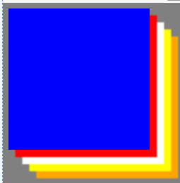

# 上午
* 注意点
    ```css
    p:first-line {}
    p#foo {}
    ```

    ```html
    <p id="foo">dawdwa
    dwadaw
    dawdaw
    </p>
    ```
    * p:first-line {} 它的优先级更高, 因为它会把第一行加一个 <first-line> </first-line> 所以它直接选中了第一行,直接选中的永远要比间接选中的优先级高. 
    ```html
    <p id="foo"><first-line>dawdwa</first-line>
    dwadaw
    dawdaw
    </p>
    * 有 !important 时
        用户样式 > 作者样式 > 浏览器内置样式表
    * 无 !important 时
        作者样式 > 用户样式 > 浏览器内置样式表

        默认样式表是由浏览器供应商提供的。
        在浏览器端的用户样式表是由使用浏览器的人提供的。
        作者样式表是由开发者提供的。

    * normalize.css
        * https://github.com/necolas/normalize.css/blob/master/normalize.css

    * em 是相对于父元素的单位

    div{
        font-size:20px
        width:20em
    }

    div#main {
        font-size:20em
        width:40em
    }

    div#footer {

    }

    * 生成随机数的算法
        * 线性同余

    * 字体
        * 衬线字体 : 有棱角
        * 非衬线字体
        * 指定退化
        * 如果想让一段话中的英文和中文的字体有差别 , 可以把英文字体写前面,中文的写后面
        * 字符集少的写前面, 多的写后面
        * 字体名称出错的话,整个 family 失效
        * 通用字体不加引号 例如: serif
        * 支持顺序: linux mac windows serif

    * 字重
        * bolder 将相对继承的字体粗,再加粗
        * 100 - 900

    * font-size 总是继承计算结果(而不是书写结果)!!!
        ```css
            div {
                font-size:150%
            }
        ```
        ```html
            <div> 
                <span>
                    16 * 150% = 24px
                </span>
            </div>
        ```
        * 老浏览器无法放大 px 单位的字体

    * font-style
        * normal
        * italic : 斜体
        * oblique : 倾斜

    * font-variants
        * small-caps 小写字母显示成小号的大写字母 (英文标题)

    * text-transform
        * uppercase 转换成小写的
        * capitalize

# 下午
* font 属性
    * [ [ <'font-style'> || <font-variant-css21> || <'font-weight'> || <'font-stretch'> ]? <'font-size'> [ / <'line-height'> ]? <'font-family'> ] | caption | icon | menu | message-box | small-caption | status-bar

    * || 表示可以交换位置

* 文字相关属性
    * text-indent 首行缩进,可以用于隐藏文字,用在块级元素上
    * text-align 行内元素居中 (第七章) 
        * 先在无线长度内展示出来, 剪断, 再排列好  每行都有 border ? 如何解决 先把左右border去掉 然后 使用 shadow(渲染好文字后,再把灯照上去) 
    ```html
        <ul>
            <li>adwa<span></span></li>
            <li>adwa<span></span></li>
            <li>adwa<span></span></li>
        </ul>
    ```

    ***property: initial*** 设置为初始状态, 它就不会接受继承,以及对它的设置
    ***all: initial*** 设置为初始状态, 它就不会接受继承,以及对它的设置(比如要在 页面中 假如广告的时候, 它就不受外面的影响了)

    ```css
    ul {
        width:300px;
    }
    ul li {
        text-align:justify; /* 让单行文字不是最后一行, 才能两端对齐 */
    }
    ul li span {
        display: inl ine-block;
        width:100%
    }
    ```
    * 单行文字两边对齐居中, 
    * 废弃的<center>元素

    * line-height 没被包着的文本 匿名文本
        * <div>
            ban 
            <span>aaa</span>
            baz
          </div>  
        * *** 纯数值(2), 继承的是书写值 ***
        * 非纯数值时(200%, 2em), 继承的是计算结果
        * line-height = height 单行文字垂直居中 (因为文字永远在 line-height 中间)
        ```css
        div {
            --h:300px;
            height: var(--h);
            line-height: var(--h);
        }
        ```
    * vertical-align 行内元素(已经被包裹的元素)
        * 设置垂直方向上的位置
            * half-leading
            * content-area
            * 行内框
        * smaller 0.66倍
        * middle (base 再往上 0.5em(X 的一半) 和图片中间对齐)
        * 百分比 相对于自己的 line-height
        * 正值向上, 负值向下(超过范围, 会撑大行高,为啥呢?)
        * 
        ```css
        div p {
            font-size:20px;
            line-height: 50px;
            background-color: pink;
        }

        div p img {
            width:10px;
            height:10px;
            vertical-align: -60px;
            background-color: yellow;
        }
        ```

        ```html
        <div>
            <p>dawdawddawdawddawdawdd</p>
            </div>
        ```

        * word-spacing 单词间隔
        * letter-space 文字(包括中英文)间隔(如果有 text-align 的话,将失效)
        * 值 单位(px):
            * 写成多少, 但此间的间隔就是空格的宽度加那个值

        * text-transform: capitalize (首字母大写)
            * heading-one => Heading-One / Heading-one

        * 每个属性都能继承, 部分是默认继承

        * text-decoration: underline, overline (两个选择选择器选中同一个标签, 设置text-decoration时: 不能同时有上划线, 以及下划线, 除非写在一起)
        * underline.js http://underlinejs.org/

        * text-shadow : 往右 往下 模糊半径 颜色 (可以有多组阴影)

        ```css
        * {
            background-color: gray;
        }

        div {
            width: 200px;
            height: 200px;
            background-color: blue;
            box-shadow:
                10px 10px 1px red,
                20px 20px 1px white,
                30px 30px 1px yellow,
                40px 40px 1px orange;
        }
        ```

        ```html
        <div></div>
        ```

        
        * box-shadow : 往右 往下 模糊半径 扩散半径(默认和原来一样大,可以增大和减小) 颜色 (可以有多组阴影)